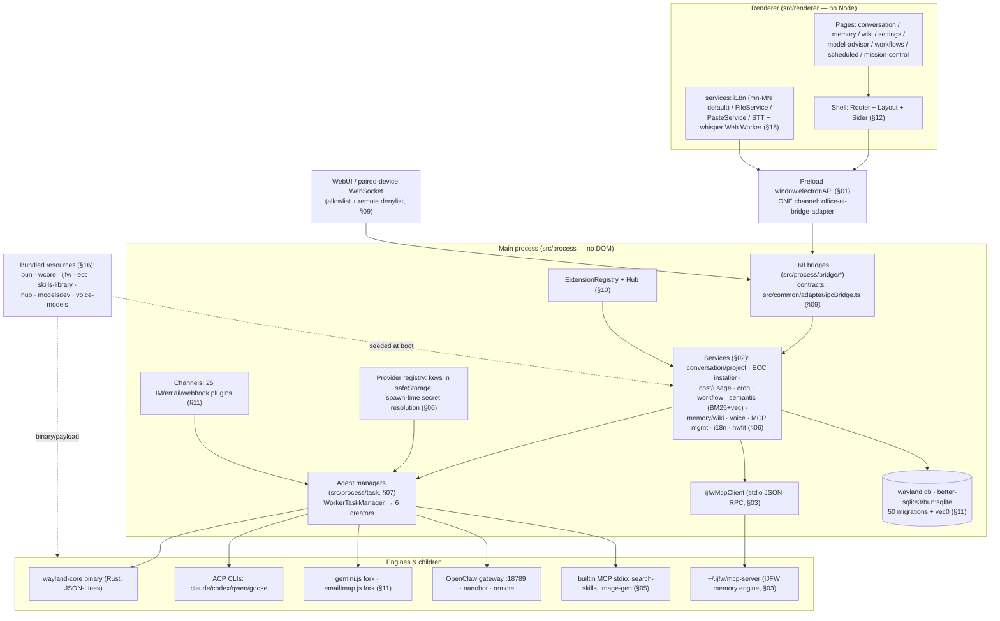

# 00 Overview — Darhai Codemap Master

> Synthesized exclusively from sections 01–17 in this directory. Every claim cites its section
> (`§NN`) and/or a code path taken from that section. This file is the entry point for the mn.6
> assimilation program (ECC, ECC hooks, Superpowers, IJFW, Odysseus).

## 1. System model

### 1.1 Three process types (§01, AGENTS.md)

Darhai is an Electron app with a hard three-way split that must never be mixed:

- **`src/process/`** — main process (no DOM APIs). Entry `src/index.ts` → `initializeProcess()`
  (`src/process/index.ts`): platform registration → `initStorage()` → ExtensionRegistry →
  ChannelManager; `initBridge.ts` side-effect-registers every IPC bridge at module load (§01, §09).
- **`src/renderer/`** — renderer (no Node APIs). Boot `src/renderer/main.tsx` → provider stack →
  `HashRouter` in `components/layout/Router.tsx`; all pages are lazy chunks (§12).
- **`src/process/worker/`** — fork workers (no Electron APIs): `gemini.ts` (agent worker) and
  `emailImap.ts` (IMAP/SMTP), built to `out/main/*.js` and spoken to over the `Pipe`/`ForkTask`
  protocol (§11).

A **standalone no-Electron twin** exists: `src/server.ts` + `register-node.ts` +
`initBridgeStandalone.ts`; the runtime-abstraction seam is `src/common/platform/IPlatformServices.ts`
(paths/worker/power/notification/network), so shared process code never calls `app.getPath`
directly (§01). Every Electron bridge added to `initBridge.ts` needs an explicit standalone
decision (§01, §09).

All renderer↔main traffic multiplexes over ONE channel, `office-ai-bridge-adapter`
(`src/common/adapter/constant.ts`), as `{name, data}` JSON; contracts are declared once in
`src/common/adapter/ipcBridge.ts` (~60 namespaces), gated by a build-time allowlist + remote-WS
denylist (`bridgeAllowlist.ts`), path confinement (`pathConfinement.ts`), and dialog/rate-limited
raw families (§09).

### 1.2 Engines (§07, §08, §06)

A conversation row becomes a running agent through `workerTaskManager`
(`src/process/task/workerTaskManagerSingleton.ts`), which registers six creators keyed by
`conversation.type` (§07):

| Type | Runtime | Manager |
|---|---|---|
| `wcore` | Bundled `wayland-core` Rust binary (v0.10.0, JSON-Lines stdio, SHA-256-gated at build) | `WCoreManager` → `WCoreAgent` (§08) |
| `acp` (+legacy `codex`) | External ACP CLIs: claude / codex / qwen / goose / custom, spawned with provider-key + Flux + `ECC_GATEGUARD` env injection | `AcpAgentManager` (§07) |
| `gemini` | Forked Node worker `out/main/gemini.js` | `GeminiAgentManager` (§07, §11) |
| `openclaw-gateway` | OpenClaw gateway (default port 18789) | `OpenClawAgentManager` (§07) |
| `nanobot` | nanobot CLI | `NanoBotAgentManager` (§07) |
| `remote` | Remote gateway agents from DB | `RemoteAgentManager` (§07) |

`AgentRegistry` (`src/process/agent/AgentRegistry.ts`) is the central registry of all detected
engines; wcore is always present (§08). Every manager reproduces the canonical stream pipeline:
gate → `transformMessage` → persist to SQLite → `ipcBridge.*.responseStream.emit` → `teamEventBus`
(terminal only) → `channelEventBus` (everything) (§07).

**Model/provider layer** (§06): `src/process/providers/` — 33-member `NativeProviderId` union,
safeStorage-encrypted creds in `model_registry_*` SQLite tables (migration v39), real-inference
connection tests, models.dev enrichment with bundled snapshot floor, 24h refresh scheduler.
Secrets are resolved only at spawn time (`hydrateModelForSpawn`); the renderer only ever sees a
non-secret handle. **hwfit** (`src/process/services/hwfit/`) is the local-model hardware advisor
(Odysseus `hf_models.json` port) behind read-only `hwfit.*` IPC (§06).

### 1.3 Bundled resources (§16)

Everything shipped enters via `scripts/prepare*.js` → `resources/<name>/` (or a checked-in source
tree: `src/process/resources/*` for skills-library/bundled-workflows, `src/process/channels/*` for
whatsapp-bridge/signal-cli-runtime) → electron-builder `extraResources` → `process.resourcesPath`:

| Payload | Producer | Runtime consumer |
|---|---|---|
| `bundled-bun` (1.3.14, SHA-gated) | prepareBundledBun.js | IJFW MCP child runtime, shellEnv fallback |
| `bundled-wayland-core` (v0.10.0, SHA-gated, fail-closed on release) | prepareWaylandCore.js | engine spawn (§08) |
| `bundled-ijfw/mcp-server` (`@ijfw/install@1.6.3`, pure JS) | prepareIjfw.js | `ijfwSystemService` seeds `~/.ijfw/mcp-server` (§03) |
| `bundled-ecc` (committed to git, pinned `ECC_PIN_SHA`) | prepareEcc.js (verify-only) | `eccSystemService` installs into `~/.claude/{rules/ecc,skills/ecc,agents,hooks}` (§02) |
| `skills-library` (2,105 entries: 1,973 skill / 107 workflow / 25 agent-profile) + `bundled-workflows` | checked in | SkillLibrary two-channel retrieval (§05) |
| `hub` (4 `aionext-*` extensions + index.json) | prepareHubResources.js | Agent Hub offline fallback (§10) |
| `modelsdev-snapshot.json` | bundle-modelsdev.ts | ModelsDevClient offline floor (§06) |
| `voice-models` (whisper-tiny ONNX) | prepareVoiceModel.js | in-renderer local STT (§15) |
| `whatsapp-bridge`, `signal-cli-runtime`, `bundled-extensions` | postinstall.js / manual / checked in | channel subprocesses, extension packs (§11, §10) |

### 1.4 Diagram

## 2. Cross-cutting contracts

| Contract | Rule (one line) | Section doc |
|---|---|---|
| **IPC bridge pattern** | Declare once in `src/common/adapter/ipcBridge.ts` via allowlist-wrapped `buildProvider`/`buildEmitter`; implement in `src/process/bridge/<x>Bridge.ts`; register in `initAllBridges` (+ standalone decision); mutation keys go on `REMOTE_DENIED_KEYS`; never throw across IPC — typed `{ok:false,error}` envelopes | `09-process-bridge-ipc.md` |
| **Config storage** | `ProcessConfig` (main) / `ConfigStorage` (renderer) over typed `IConfigStorageRefer` (`src/common/config/storage.ts`); on-disk `wayland-config.txt` (base64+atomic 0o600); one-shot `migration.*` flag pattern; localStorage is UI-ephemera only | `01-process-core-infra.md`, `15-renderer-services-common-config.md` |
| **i18n** | mn-MN default (`i18n-config.json`), 13 languages × 32 modules; keys typed in generated `i18n-keys.d.ts` (`bun run i18n:types` + `check-i18n.js` gate in CI); dual i18next instances (renderer + main-tray); language changes broadcast via `systemSettings.languageChanged` | `15-renderer-services-common-config.md` (+ §16 CI gate) |
| **Skill system** | Two-channel: bounded set (`_builtin` + pinned + enabledSkills) symlinked into agent workspaces vs full 2,105-entry library reachable only via `wayland_search_skills` MCP; SkillGuard scan-before-persist, blocked = fail-closed at every layer; sources merge on `SkillLibrary.registerSource` | `05-process-skills-system.md` |
| **Memory (IJFW)** | `~/.ijfw/mcp-server` child (bundled-bun runtime), newline-JSON-RPC via `ijfwMcpClient`; renderer verbs pass `ALLOWED_VERBS` + zod at `ijfwBridge`; archive reads bypass MCP (direct fs over `.ijfw/memory/*.md`); staged `.pending` upgrades + rollback | `03-process-ijfw-memory.md` (+ §04 import pipeline, §14 UI) |
| **Packaging pipeline** | `build-with-builder.js` orchestrates: vite build → prepare* stagers → electron-builder; everything shipped is pinned + SHA-verified or committed; fuses flipped in afterPack; CI publishes drafts only | `16-build-packaging-ci.md` |
| **Agent stream pipeline** | persist-before-emit order; 120ms stream DB buffering; error→finish pairing; turnCompleted dedupe; prompt-cache byte-stability; in-message text protocols (`[CRON_*]`, `[LOAD_SKILL:]`) | `07-process-agent-managers.md` |
| **Database** | `<dataPath>/wayland.db`, `PRAGMA user_version` = 50; additive transactional migrations + per-migration bun test; `IQueryResult` never-throw rows; repos = sync prepared statements | `11-process-channels-worker-db.md` |
| **Extensions/Hub** | `aion-extension.json` manifests, 10 contribution slots; SHA-512 SRI install gate + native confirm dialog; vendored overlays are non-destructive | `10-process-extensions-hub.md` |
| **Testing** | Suffix routing (`.test` / `.dom.test` / `.e2e` / `.bun.test` / `.redteam.test`); placement mirrors src; `describeNativeSqlite` ABI gate; every security surface gets a red-team twin | `17-tests-architecture.md` |

## 3. ASSIMILATION MASTER ANCHOR TABLE (mn.6)

### 3a. ECC skills / rules / commands / agents → Darhai skill + rules sanctums

Current state: `resources/bundled-ecc` is committed + pinned (`ECC_PIN_SHA`, §16);
`eccSystemService.seedEccIfAbsent()` installs into `~/.claude/{skills/ecc,rules/ecc,agents,ecc/install-state.json,hooks/hooks.json}` 7s after launch, never-clobber (§02). mn.6 target = pull that content into Darhai-native sanctums instead of a foreign `~/.claude` install.

| ECC asset | Target subsystem | Concrete anchors |
|---|---|---|
| ECC **skills** (817-pack subset) | SkillLibrary as a new source, or vendored corpus | New `SkillSource` value + loader mirroring `CliSkillDiscovery.ts`, called from `initSkillsBridge()` (§05 anchor 1); large corpora extend `skills-library/index.json` + `bodies/` or copy the `bundled-workflows` optional-corpus pattern + `electron-builder.yml` extraResources (§05 anchor 2); retrieval namespace via `semantic/types.ts` + a lane mirroring `skillSemanticLane.ts` (§02 anchor 6) |
| ECC **rules** | Prompt-composition layer + per-project knowledge | Constitution overlay `constitution/composePrompt.ts` (byte-stable, §02); per-project `.darhai/rules.md` via `projectKnowledge/knowledge.ts` KNOWLEDGE_FILE map + `ConversationServiceImpl.injectProjectKnowledge` writing `extra.presetRules`/`presetContext` (§02 anchor 8); system-prompt overlays in `agentUtils.ts` (`prepareFirstMessageWithSkillsIndex` / `buildSystemInstructionsWithSkillsIndex`, §07 anchor 4) |
| ECC **commands** (slash-style workflows) | Skill-typed library entries + workflow sessions | `skills.list` already supports `type:'workflow'` (§09); workflow runtime = `WorkflowSessionService` + `parseSteps` + `dispatchAutonomousStep` (§02 anchor 5); in-message command protocols mirror the cron trio `CronCommandDetector` → `MessageMiddleware` (§07 anchor 3) |
| ECC **agents** (reviewer/planner personas) | Vendored assistant merge | `agentProfileMerge.ts` (25 agent-profile → assistants, curated `agentProfileSkills.json`) called from `ExtensionRegistry.resolveContributions` (§10 anchor 2); presets via `ASSISTANT_PRESETS` (`src/common/config/presets/assistantPresets.ts`, §15) |
| Install/packaging | Bundled-payload pipeline | `prepareEcc.js` verify-default + smoke-install assertion is the exact template (§16 anchor 1); status/toggle IPC = `ecc.get-status`/`ecc.set-gate-guard` next to `ipcBridge.ts:1647` (§09); settings pane = `EccSettingsPanel.tsx` clone recipe (§14 anchor 1) |

### 3b. ECC hooks → app-level guard at the tool-approval boundary

Current state: hooks are materialized per workspace — `~/.claude/hooks/hooks.json` copied into
`<workspace>/.claude/settings.local.json`, atomic, only when no `hooks` key exists, called from
`AcpAgentManager.ts:1217` on agent spawn; GateGuard is a ProcessConfig toggle
(`ecc.gateGuardEnabled`, default ON) injecting `ECC_GATEGUARD=off` into claude spawns when off
(§02). mn.6 target = enforce equivalent gating inside Darhai's own approval pipeline, not via CLI
hook files.

| Concern | Anchor files |
|---|---|
| Tool-approval choke point | `BaseAgentManager.addConfirmation` (yolo auto-picks first option after 50ms), team-internal MCP auto-approve, per-manager `ApprovalStore` (§07 invariant 7); `IpcAgentEventEmitter` → `conversation.confirmation.add/update/remove` (§07) |
| Engine-side approve/deny | wcore `tool_approve`/`tool_deny` commands + `WCoreEvent` handler arms (§08); channel yolo set `CHANNEL_AUTO_APPROVE_SOURCES` (§11) |
| Renderer approval UI | `ConversationChatConfirm.tsx` (banner + `conversation.confirmation.confirm`), `MessageAcpPermission.tsx` (§13) |
| Settings-driven env/behavior toggle template | GateGuard triple: ProcessConfig key → bridge provider (`eccBridge.ts`) → env injection at spawn (`AcpAgentManager.ts:574-581`) → `EccSettingsPanel.tsx` (§02 anchor 2, §07 anchor 2); `ecc.set-gate-guard` is remote-denied (§09) |
| Workspace-scoped materialization (if hook files stay) | `ensureWorkspaceEccHooks` pattern: `<workspace>/.claude/settings.local.json`, non-destructive, atomic (§02 anchor 3); never touch `customWorkspace` (§07 invariant 12) |

### 3c. Superpowers 14 merged skills → builtin skills

| Concern | Anchor files |
|---|---|
| Always-on (auto-injected for every agent) | `src/process/resources/skills/_builtin/<name>/SKILL.md` (imitate `_builtin/cron/`); initStorage sync (`initBuiltinAssistantRules`) + workspace symlinker (`initAgent.ts:126-148`) pick it up with zero code (§05 anchor 3, §01 anchor 4) |
| Opt-in per assistant | Top-level `src/process/resources/skills/<name>/` (imitate `officecli-docx/`); enablement flows `ASSISTANT_PRESETS` → `getBuiltinAssistants()` → `enabledSkills` (§01 anchor 4) |
| Frontmatter contract | `AcpSkillManager.parseFrontmatter` (name required; metadata block) (§05) |
| Guard/scan | New content still passes SkillGuard conventions; bump `SKILL_SCANNER_VERSION` if rules change (§05 anchor 4) |
| Skill-creation loop (Superpowers `writing-skills` analog) | Resurrect `SkillRuleGenerator.tsx` (unmounted; `---PRESET_BEGIN---` capture over `conversation.responseStream` → preset registration) (§13 anchor 5); builder save flow scans-before-write in `skillsBridge.ts` (§05) |

### 3d. IJFW memory-server → in-app module

Today: external child at `~/.ijfw/mcp-server` (npm-staged, bundle-seeded, `.pending`
staged upgrades + spawn-test verify + rollback), spoken to by `ijfwMcpClient` over newline
JSON-RPC; renderer reaches it through `ijfw.brain-invoke` with a 20-verb allowlist (§03).

| Concern | Anchor files |
|---|---|
| Client seam to swap child → in-process | `ijfwMcpClient.invoke()` is the single call surface; verb maps `DIRECT_TOOL_MAP` (12) + `BRAIN_VERBS` (8) (`ijfwMcpClient.ts:44-82`); internal consumers get `invoke` by injection and fail soft (`TeamSession.ts:63-70`, `VerificationGate`) — an in-app module only needs to satisfy this function signature (§03 anchors 3, 5) |
| Trust boundary stays | `ipcSchemas.ts` `ALLOWED_VERBS` + zod + prototype-pollution scan + 1MiB cap — keep even when in-process (§03) |
| Reads already in-app | Memory Archive reads `.ijfw/memory/*.md` directly via `ijfwArchiveService` (bypasses MCP by design); wiki index/synthesis/auto-sync are Darhai-native (`src/process/services/{memory,wiki}/`) (§02, §03) |
| Import pipeline is Darhai-native | `src/process/services/import/*` + `importBridge` (`memory.import.*`, `memory.ingest-files`) already write MemoryEntry markdown into `~/.ijfw/memory` (§04) |
| Prelude/`CLAUDE.md` blocks | `preludeManager.ts` sentinel rewriting (§03) |
| Lifecycle/UI status pattern (for whatever remains external) | `ijfwSystemService` status union + `emitStatus` + guarded deferred boot block `src/index.ts:636-668` (§03 anchor 4); Memory page 6-state machine (§14) |
| Semantic lane | `memorySemanticLane` + `SqliteVecStore` vec_memory (§02); v50 shadow tables (§11) |

### 3e. Odysseus features → Darhai core

Legend per row: **Service dir** (main-process home) · **Bridge ns** (ipcBridge namespace) ·
**Renderer** (page/route) · **i18n** (module) · **Analog** (closest existing feature to imitate).

| Odysseus feature | Service dir | Bridge ns | Renderer page/route | i18n module | Closest analog to imitate |
|---|---|---|---|---|---|
| **cookbook-serve** (local-model serve/download) | `src/process/services/hwfit/` (extend) + NEW `src/process/services/cookbook/` for the orchestrator — hwfit is deliberately read-only (§06 anchor 5) | NEW `cookbook.*` next to `hwfit` (`ipcBridge.ts:1090`); mutations remote-denied | `pages/model-advisor/` (`/model-advisor`) extended, or sibling page via §12 anchor 1 | `modelAdvisor` (exists) | hwfit trio (service+bridge+page, §06 anchor 1); keyless local daemon = `ollama-local` plumbing (§06 anchor 2); downloads = `voice/VoiceAssetManager` SHA-verified streaming (§02); background staleness loop = `ModelRefreshScheduler` (§06 anchor 6) |
| **memory auto-extraction** (post-conversation memory capture) | `src/process/services/memory/` (beside `promotionSweep`, `ijfwArchiveService`) | `memory.*` (`ipcBridge.ts:2359`) — add providers next to `memory.promote` | `pages/memory/` (`/memory`) — surface in FullPanelShell/status bar | `memory` + `archive` (⚠ archive is an mn-MN-only untracked module, §15) | turn-lifecycle consumer on `conversation.turnCompleted` (§07 anchor 6); extraction sweep = `promotionSweep` + `wikiAutoSync` (§02); importer shape = §04 anchor 1; in-message protocol (`[MEMORY_STORE]`-style) = cron trio (§07 anchor 3) |
| **deep research** (multi-step fan-out research) | NEW `src/process/services/research/` mirroring `workflow/` package layout (§02 anchor 4/5 shape) | NEW `research.*` modeled on `workflow.*` (`ipcBridge.ts:2150`) | NEW `/research` page via §12 anchor 1; running-state accordion via §12 anchor 4 | NEW module (register in `i18n-config.json` + 13 barrels, §15 anchor 2) | `WorkflowSessionService` + `dispatchAutonomousStep` + `autonomousWatchdog` (§02 anchor 5); step-sequenced prompts via `useConversationCommandQueue` (§13 anchor 6); search backends = engine tool keys TAVILY/EXA/BRAVE (§08 anchor 2) |
| **notes + tasks + scheduler** | `src/process/services/cron/` (scheduler exists) + `missionControl/TaskLedgerService` (merged ledger) + notes via `memory.setQuickAdd`/`projectKnowledge` | `cron.*` (`ipcBridge.ts:1050`), `missionControl.*` (1079), `memory.*` | `/scheduled` (`pages/cron/`), `/mission-control`, ComposerModal quick-add in `/memory` | `cron` family (`settings.*`/`sider.*` keys), `memory` | `CronService` + `BuiltinRoutinesSeeder` (bundled DISABLED routines, §02 anchor 5); ledger merge = `TaskLedgerService` per-source degradation (§02); sidebar live list = `SiderScheduledSection` accordion (§12 anchor 4) |
| **documents editor** | `src/process/services/conversionService.ts` (docx/xlsx/pptx/pdf) + officecli watch bridges (`officeWatchBridge`/`pptPreviewBridge`) | `document.*` (854), `preview.*` (842), `previewHistory.*` (832) | Preview panel (`pages/conversation/Preview/**`): TipTap markdown, Monaco, HTMLEditor; opened via `preview.open` | `conversation`/`messages` families | New Preview content type recipe (§13 anchor 4: `PreviewContentType` + `FILE_EXTENSION_MAP` + viewer + dispatch); external-process rendering = `OfficeWatchViewer` + `officecli watch` spawn pattern (§09) |
| **compare** (side-by-side model/output compare) | NEW `src/process/services/compare/` using `completion/oneShot.ts` fan-out + `CostRecorder` metering | NEW `compare.*` (read-only, imitate `hwfit` block style §06 anchor 1) | NEW `/compare` page on `PageShell width='full'` (§14 anchor 5) | NEW module | `oneShotComplete` multi-provider REST routing (§02); model enumeration = `modelRegistry.curatedForAgent` (§06); page shape = `pages/model-advisor/` one-SWR-hook pattern (§14 anchor 5) |
| **email triage** | `src/process/channels/plugins/tier1/email-imap/` (plugin + forked `emailImap.js` worker exist); triage logic as new channel actions | `channel.*` (1495) | `/settings/channels` details (`ChannelsIndex/details/`); triage surfaces could join Mission Control | `settings` (channels keys) | email-imap plugin + `EmailImapWorkerClient` ForkTask (§11); new commands = `actions/SystemActions.ts` handler registry (§11 anchor "new channel command/action"); auto-reply turns already flow `channelEventBus` → `ChannelMessageService` (§11) |
| **calendar** | `src/process/services/cron/` (`at`/`every`/`cron` schedule kinds in `CronStore.ts`) + `missionControl/` | `cron.*`, `missionControl.*` | NEW `/calendar` view over cron jobs + `mission-control.snapshot`, via §12 anchor 1; or extend `/scheduled` | NEW module (or extend cron keys) | `/scheduled` cron UI + `SiderScheduledSection` route-aware accordion (§12 anchor 4); unified snapshot = `TaskLedgerService` (§02); native notifications = `IpcCronEventEmitter` (§02) |
| **web search** (first-class tool) | NEW builtin MCP stdio server in `src/process/resources/builtinMcp/` (factory + entry pair) | MCP catalog registration in `initStorage.ensureBuiltinMcpServers` (not an ipcBridge ns); key mgmt via `wcoreToolKeys.*` (1896) | Settings: `WCoreConfig` ServicesKeysPane (keys exist: BRAVE/TAVILY/EXA/FIRECRAWL) | `settings` | `searchSkillsServer.ts`/`searchSkillsServerEntry.ts` + `build-mcp-servers.js` esbuild entry + catalog registration + boot canary (§05 anchor 6, §01 anchor 5); engine-side keys = `TOOL_KEY_ENV_MAP` (§08 anchor 2) |

Shared recipes for every row: new page = §12 anchor 1 (route + Sider entry + i18n); new settings
pane = §14 anchor 1; new persisted toggle = `IConfigStorageRefer` key + GateGuard pattern (§15
anchor 1); new DB table = migration v51+ recipe (§11 anchor); tests = §17 anchors (unit mirror +
allowlist red-team row + e2e via `invokeBridge`).

## 4. Open questions (flagged unverified/stub by the sections)

1. **§04**: `resolveMemoryDir()` always returns `~/.ijfw/memory` — the project-scoped branch is an
   acknowledged stub; per-project import targeting requires completing this one function.
   `buildFrontmatter` is copy-pasted 5× (DRY debt anchor).
2. **§05**: SkillGuard LLM layer has **no production model wired** (`skillGuardLlmScan.ts` seam
   only); `skills.build.draft` returns a stub template.
3. **§03**: `degradedMode.ts` has no external callers (reserved); IJFW verb schemas can drift from
   the live server contract and fail silently — verify against the live server when adding verbs.
4. **§06/§08**: local win32-x64 wcore `manifest.json` says `sourceType: local-prebuilt`,
   `verified: false` — dev-only artifact; release builds fail closed, but the local tree is
   unverified.
5. **§10**: `ExtensionWatcher` (fs hot-reload) exported but never instantiated in production;
   `hub.check-updates` is a stub, `hub.uninstall` unsupported, HubStateManager update-check TODO
   commented out; `bundle-vendored/README.md` count ("45") lags actual 55 assistants.
6. **§13**: `SkillRuleGenerator` unmounted (import commented out); `MessageAvailableCommands`
   renders null.
7. **§14**: `OnboardingEmptyState.tsx` is an orphan (no importers); `WCoreSettings.tsx` dead-ish
   (Router keeps it alive with `void`); WikiHomePage raw `<button>`s predate the Arco-only rule.
8. **§15**: mn-MN carries 3 locale modules (`conversations`, `archive`, `wiki`) absent from
   `i18n-config.json#modules` — bundled but untyped/unvalidated (named the anti-pattern to fix);
   main-process i18n registers only 8 of 13 locales (es/pt/de/fr/uk fall back to en in tray/menu).
9. **§17 vs §14**: resolved — the app DOES carry `data-testid` attributes (~550 occurrences across
   memory/settings/newer surfaces; §14 is right). §17's "no `data-testid`" traces to the stale
   `tests/e2e/helpers/selectors.ts` header, which predates them; prefer testids for new e2e
   selectors. Also: `tests/regression/` glob matches a directory that does not exist;
   `cdpDriver.ts` hardcodes a macOS `ELECTRON_BIN` path.
10. **§12**: icon-library discrepancy — AGENTS.md mandates `@icon-park/react`, the shell has
    standardized on `lucide-react` ("follow the file you're touching").
11. **§16**: old `asarUnpack` entries for skills-library matched nothing (now shipped via
    extraResources direct copy) — verify no stale references when adding corpora.
12. **§02**: `wikiSynthesizer` LLM path stubbed (heuristic fallback always used).
