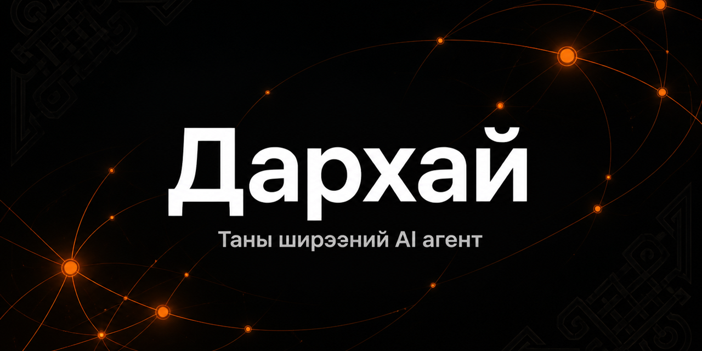

<!--
  Дархай — Танилцуулга. Олон нийтэд зориулсан бүтээгдэхүүний танилцуулга баримт.
  Нэр томьёо нь аппын mn-MN локалчлалтай (src/renderer/services/i18n/locales/mn-MN/)
  нэг мөр байх ёстой. Шинэ боломж нэмэхдээ эхлээд локал файлуудаас баталгаажуулна.
-->

# Дархай — Танилцуулга

**Дархай** бол таны компьютер дээр ажилладаг **локал-түрүүт дэсктоп AI агент апп** юм. Claude Code, Codex, Gemini, Qwen, Goose зэрэг та аль хэдийн ашигладаг AI CLI хэрэгслүүдийг нэг командын төвөөс удирдаж, тэдгээрийг нэг санах ой, нэг ажлын урсгалтай **нэг баг** болгодог. Таны түлхүүр, таны файл, таны shell — бүгд таны машин дээр үлдэнэ.

Дархай нь Ferrox Labs-ын нээлттэй эхийн **Wayland** төслийн монгол хэл дээрх салбар (fork) бөгөөд Монголын хэрэглэгч, байгууллагад зориулж бүрэн монголчлогдсон.

---

## Дархай гэж юу вэ

Ихэнх AI хэрэгсэл бол нэг загвар руу харах чат цонх: хаах болгонд бүгдийг мартаж, дараагийн удаа тэгээс эхэлдэг. Дархай бол өөр зүйл — **хуримтлагддаг систем**:

- **Хүлээн авна** — таны хүсэлт, файл, төсөл, санах ойн төлөвийг.
- **Бодно** — ажилд тохирох загвараар; шаардлагатай бол зөвхөн-унших Plan горимд эхлээд төлөвлөгөө бичнэ.
- **Үйлдэнэ** — суурилуулсан хэрэгслүүд (Read, Write, Edit, Bash, Grep, Glob) болон MCP холбогчоор, үйлдлийн системийн төрөлх (native) sandbox дотор.
- **Санана** — сешн хооронд тогтдог, SQLite суурьтай санах ойгоор дараагийн ажилдаа туршлагаа авч явна.

Суулгагч нь **Darhai-Core** хөдөлгүүрийг (нэг Rust binary, ойролцоогоор 47 MB — Node, Python runtime шаардахгүй) багтаасан тул нийлүүлэгчийн түлхүүр нэмэх даруйд агентууд ажиллана.

## Хэнд зориулагдсан бэ

- **Монголын байгууллагууд** — өгөгдлөө өөрийн компьютер, өөрийн сүлжээнд хадгалахыг шаарддаг компани, төрийн болон санхүүгийн байгууллага. Дархай үүлэн зуучлагчгүй, захиалгагүй, бүртгэлгүй ажиллана.
- **Хөгжүүлэгч, мэргэжилтнүүд** — Claude Code, Codex, Gemini CLI гэх мэт хэд хэдэн хэрэгсэл ашигладаг ч тэдгээрийг тус тусад нь ажиллуулж залхсан хүмүүс.
- **AI-г ажилдаа нэвтрүүлж буй баг, хэрэглэгчид** — судалгаа, бичвэр, борлуулалт, үйл ажиллагааны бүтэн ажлыг AI-тай хамтран гүйцэтгэхийг хүссэн хэн бүхэн. Программист байх шаардлагагүй.

## Гол боломжууд

Доорх нэр томьёо нь аппын монгол интерфэйст харагдах яг тэр нэрс юм.

### Нэг агент бүгдийг удирдана

Claude Code, Codex, Gemini, Qwen, Goose болон арав гаруй **CLI агентыг** нэг цонхноос ажиллуул. Ажлын дундуур **Загвар сонгох** цэснээс загвараа сольж болно. Anthropic, OpenAI ба OpenAI-нийцтэй (DeepSeek, Ollama орно), AWS Bedrock, Google Vertex AI зэрэг нийлүүлэгчид хөдөлгүүрт шууд дэмжигдэнэ.

### Туслахууд ба Багууд

- **Туслахууд** — салбараа мэддэг, ур чадварын багцтай, бэлэн тохируулсан AI мэргэжилтнүүд. Өөрийн туслахыг дүрэм, промпт, ур чадвартай нь өөрөө бүтээж болно.
- **Багууд** — ахлагчтай, гишүүдтэй AI багууд: зорилгоо хэлэхэд бүрэлдэхүүнээ санал болгож, нэг хуваалцсан самбар дээр ажил дуустал хамтран ажиллана. Тогтмол ажилладаг багийг **Байнгын компани** болгон хадгална.

### Ажлыг үргэлжлүүлдэг Төслүүд

**Төсөл** нь холбоотой чатууд, файлууд, **мэдлэгийн сан** (заавар, дүрэм, шийдвэр, лавлагааны файлууд), төслийн санах ойг нэг дор хадгална. Олон долоо хоногийн ажлаа орхисон газраасаа үргэлжлүүл.

### Ур чадварууд

**Ур чадварын төв**-өөс 2,000+ бэлэн ур чадвартай сангаас сонгох, өөрөө бүтээх, хавтас/Git/ZIP-ээс импортлох боломжтой. Импортын үед аюулгүй байдлын скан хийгдэж, сэжигтэй ур чадварыг тусгаарлана. `~/.claude/skills`, `~/.codex/skills`, `~/.gemini/skills` дахь одоо байгаа ур чадваруудыг тань автоматаар илрүүлнэ.

### Санах ой

Ferrox Labs-ын нээлттэй эхийн **IJFW** хөдөлгүүрт суурилсан **Санах ой** нь таны хийсэн, шийдсэн зүйлсийг чат, төсөл, CLI-уудын хооронд тогтвортой хадгална. Санах ойгоос **Вики** рүү мэдлэг дэвшүүлж, хайж, экспортолж болно. Бүгд таны диск дээрх SQLite-д хадгалагдана.

### Ажлын урсгал ба Хуваарьт даалгаврууд

177 бэлэн **ажлын урсгал** — санаанаас үр дүн хүртэл алхам алхмаар дагуулах жорууд. Давтагдах ажлыг **хуваарьт даалгавар** болгон товлож (өдөр, долоо хоног, сар бүр), үр дүнг нь чатаараа хүлээн ав. Бүх ажиллаж буй зүйлийг **Удирдлагын төв**-өөс нэг дор хянана.

### MCP интеграц

Model Context Protocol серверүүдийг stdio, SSE, streamable-HTTP-ээр нэмж, агентдаа Gmail, Stripe, Slack, Asana гэх мэт гадаад системд үйлдэл хийлгэ. Хэрэгсэл бүрийн гүйцэтгэлийг зөвшөөрөх/татгалзах хяналттай.

### Сувгууд

Дэсктопоо орхисон ч агенттайгаа ажилтантайгаа бичилцдэг шиг харьц: Telegram, Slack, Discord, WhatsApp, Signal, Matrix, MS Teams, LINE зэрэг **сувгаар** холбогдоно (нийт 25 суваг, үе шаттайгаар нэмэгдэж байгаа).

### Алсын хандалт (WebUI)

**QR кодоор нэвтэрч** утас болон дурын хөтчөөс бүх зүйлийг удирд. Headless сервер дээр байршуулж, багаараа хандах боломжтой — [WebUI заавар](guides/webui.md), [сервер байршуулалт](guides/deploy-server.md).

### Локал ажиллагаа ба өгөгдлийн нууцлал

- Түлхүүрүүд үйлдлийн системийн keychain-д, өгөгдөл диск дээрх SQLite-д хадгалагдана.
- Shell командууд OS-ийн төрөлх (native) sandbox дотор (Linux дээр Landlock, macOS дээр sandbox-exec, Windows дээр AppContainer) гүйцэтгэгдэнэ.
- Ollama-тай холбовол **бүрэн офлайн** ажиллана — ямар ч сүлжээгүйгээр.
- Дархай-хостинг backend байхгүй: бүртгэл, захиалга, үүлэн зуучлал шаардахгүй.

## Яагаад монгол хэл түрүүлж вэ

Дэлхийн AI хэрэгслүүд монгол хэрэглэгчийг англи интерфэйс, англи баримтжуулалтаар угтдаг. Дархайд **монгол хэл нь анхдагч**:

- Интерфэйс бүхэлдээ монголоор — цэс, тохиргоо, алдааны мэдэгдэл хүртэл.
- Баримтжуулалт монголоор бичигдсэн ([Хэрэглэгчийн гарын авлага](guides/user-manual.md)).
- Хүсвэл Тохиргоо доторх **Хэл** сонголтоор English рүү шилжиж болно.

Байгууллагын дотоод хэрэглээнд ажилтан бүр төрөлх хэлээрээ AI-тай ажиллана гэдэг нь нэвтрүүлэлтийн хамгийн том саадыг арилгана гэсэн үг.

## Лиценз ба гарал үүсэл

Дархай нь дэсктоп апп, Darhai-Core хөдөлгүүр хоёулаа **GNU AGPL-3.0** лицензтэй жинхэнэ нээлттэй эх. Ажиллуулах, өөрөө хостлох, өөрчлөх, fork хийх, дээр нь арилжааны үйлчилгээ бүтээх эрх чөлөөтэй; AGPL-ийн нөхцөлөөр үүн дээр бүтсэн сүлжээний үйлчилгээ эх кодоо ижил нөхцөлөөр нийтлэх үүрэгтэй.

Дархай нь **Ferrox Labs**-ын нээлттэй эхийн **Wayland** төслөөс салбарласан бие даасан төсөл бөгөөд Ferrox Labs-тай албан ёсны хамаарал, түншлэл байхгүй. Upstream төслийн хөгжлийг тогтмол дагаж, сайжруулалтуудыг нь монгол хувилбартаа нэгтгэдэг.

> Нэрийн тухайд: upstream төсөл нь юу ч хийж чаддаг байсан домгийн уран дархан _Wayland the Smith_-ийн нэрийг зүүсэн бол «Дархай» нь мөн л «уран дархан» гэсэн монгол утгыг тээнэ.

## Холбоосууд

| Юу                        | Хаана                                              |
| ------------------------- | -------------------------------------------------- |
| Эх код                    | <https://github.com/sergei10a-rgb/darhai>          |
| Татах (Releases)          | <https://github.com/sergei10a-rgb/darhai/releases> |
| Хэрэглэгчийн гарын авлага | [guides/user-manual.md](guides/user-manual.md)     |
| Замын зураг               | [ROADMAP.md](ROADMAP.md)                           |
| Баримтжуулалтын бүтэц     | [README.md](README.md)                             |
| Лиценз                    | [LICENSE](../LICENSE)                              |
